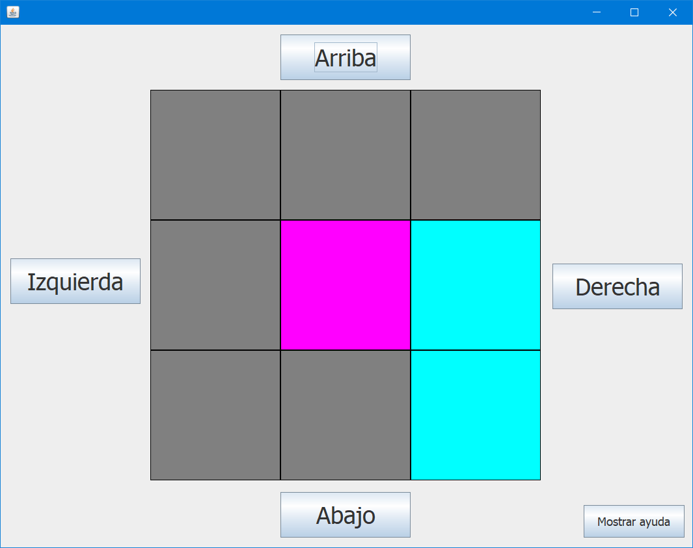

# Laberinto

El programa permite al usuario resolver el laberinto propuesto. Si necesita ayuda, el programa permite ver la solución.

## Tabla de Contenido

1. [Instalación](https://github.com/SantiagoArboleda1/Laberinto/tree/master#1-instalaci%C3%B3n)
2. [Instrucciones de uso](https://github.com/SantiagoArboleda1/Laberinto/tree/master#2-instrucciones-de-uso)
3. [Manual técnico](https://github.com/SantiagoArboleda1/Laberinto/tree/master#3-manual-t%C3%A9cnico)

## 1. Instalación
Hay 2 opciones:

- Descargar la ultima versión  del JAR [aqui](https://github.com/SantiagoArboleda1/Laberinto/releases).
- Descargar el código fuente y abrirlo en NetBeans.

## 2. Instrucciones de uso

El objetivo del juego es llegar al final del laberinto. El jugador puede únicamente por los caminos (de color cyan). Las casillas de color gris representan los muros. La casilla central, color magenta, representa al jugador. Si decide activar la solución, algunos caminos se mostraran de color verde, indicando el camino correcto. Si no ve ningún camino verde, considere retroceder hasta encontrarlos.

- Botón **"Arriba"**: Registra un movimiento hacia arriba.
- Botón **"Abajo"**: Registra un movimiento hacia abajo.
- Botón **"Izquierda"**: Registra un movimiento hacia la izquierda.
- Botón **"Derecha"**: Registra un movimiento hacia la derecha.
- Botón **"Mostrar ayuda"**: Muestra la solución del laberinto.
- Botón **"Ocultar ayuda"**: Oculta la solución del laberinto.

## 3. Manual técnico
